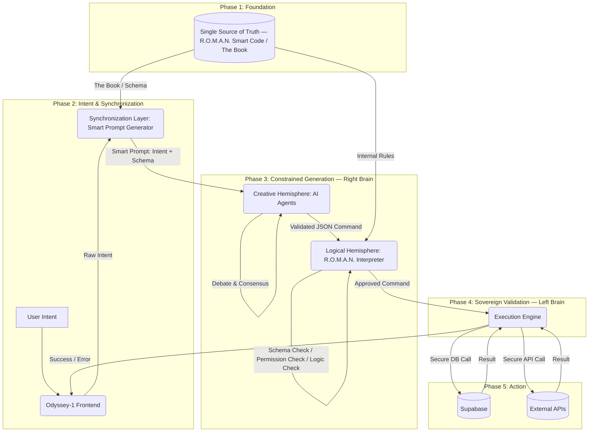

# SOVEREIGN-CORE ARCHITECTURE: DUAL-HEMISPHERE AI SYSTEM
## Technical Specification — USPTO Application #63/913,134

**Inventor:** Rickey Allan Howard
**Trust:** Howard Jones Bloodline Ancestral Trust
**Source:** D:\Dual Hemosphere..pdf (original blueprint document)
**Conversion Deadline:** November 7, 2026
**Status:** PATENT PENDING — Provisional filed November 7, 2025

---

## CORE PRINCIPLE: THE SYNCHRONIZATION PRINCIPLE

The system's integrity does not come from correcting a flawed AI. It comes from preventing
flawed thinking from the start. This is achieved by ensuring both the Creative Hemisphere (AI)
and the Logical Hemisphere (R.O.M.A.N.) operate from a **Single Source of Truth** — a
non-negotiable contract that defines the system's reality.

---

## THE 5 ARCHITECTURAL COMPONENTS

### Component 1: The Single Source of Truth ("The Book")
The foundational "smart code" repository. Not executable code but a collection of definitions
and schemas that act as the system's "physics."

**What it contains:**
- R.O.M.A.N. Command Schemas: The exact structure of a valid command
  (`type RomanCommand = {...}`)
- Enumerated Actions: The only allowed actions
  (`type RomanAction = "CREATE" | "DELETE" | ...`)
- Enumerated Targets: The only valid targets
  (`type RomanTarget = "USER_PROFILE" | "PROJECT_TASK" | ...`)
- Payload Structures: The required data for each action
  (e.g., CREATE_USER requires `email` and `name`)

**Implementation:** TypeScript definitions, Zod schemas, or a central JSON file.

---

### Component 2: The Synchronization Layer ("The Librarian")
The R.O.M.A.N. Smart Prompt Generator. The critical piece that hands "The Book" to the AI
every single time.

**What it does:**
1. Receives the raw user intent (e.g., "delete that task")
2. Loads the Single Source of Truth (Component 1)
3. Dynamically constructs a "paint-by-numbers" prompt
4. Injects the "smart code" as a rigid template — AI fills in the blanks

**Implementation:** Backend service

---

### Component 3: The Creative Hemisphere ("The Right Brain")
The AI Core where intent is turned into a plan.

**What it does:**
- Receives the Smart Prompt from Component 2
- Thinking is constrained by injected schema — cannot invent a flawed command
- Multi-Agent Consensus (optional): Multiple agents receive same prompt, outputs
  cross-referenced ("the debate") to select the most optimal solution
- Outputs a perfectly-formed, schema-compliant RomanCommand as JSON

**Implementation:** One or more LLM agents (e.g., Claude, Gemini)

---

### Component 4: The Logical Hemisphere ("The Left Brain")
The R.O.M.A.N. Interpreter. The final, sovereign arbitrator that trusts nothing and
verifies everything.

**What it does:**
1. Receives the "perfect" JSON command from the AI
2. Validates again against its own internal copy of the Single Source of Truth
   (crucial security redundancy)
3. Performs Final Checks — logic the AI cannot know:
   - Permission Check: Does this user have authority to perform this action?
   - Business Logic Check: Is this target in a state that allows this action?
4. If all checks pass, approves the command for execution

**Implementation:** Secure backend interpreter engine

---

### Component 5: The Execution Engine ("The Hands")
Does the actual work — only after the Logical Hemisphere gives approval.

**What it does:**
- Receives the approved, validated command
- Makes the actual Supabase call (`supabase.from('tasks').delete()...`)
- Calls any external APIs
- Returns success or error message

**Implementation:** Secure functions interfacing with database and APIs

---

## FULL OPERATIONAL FLOW

```
Intent:       User types "Get rid of the 'Deploy' task."

Synchronize:  Synchronization Layer (Component 2) activates.
              Grabs user intent + Single Source of Truth.
              Builds Smart Prompt:
              "Here is the R.O.M.A.N. schema: [Component 1]...
               Now fill this schema to satisfy: 'Get rid of Deploy task'."

Generate:     Prompt sent to Creative Hemisphere (Component 3).
              AI sees DELETE action + PROJECT_TASK target in schema.
              Flawed thinking is blocked.
              Outputs valid JSON:
              { "action": "DELETE", "target": "PROJECT_TASK",
                "payload": { "taskName": "Deploy" } }

Validate:     JSON sent to Logical Hemisphere (Component 4).
              Check 1: Is the user logged in? → Yes
              Check 2: Does user have DELETE permissions? → Yes
              Check 3: Does "Deploy" task exist? → Yes
              Result: APPROVED

Execute:      Approved command passed to Execution Engine (Component 5).
              Runs DELETE query in Supabase.

Feedback:     Engine returns "Success."
              Frontend updates. User sees task disappear.
```

---

## VISUAL BLUEPRINT (Mermaid Diagram)



---

## CODEBASE IMPLEMENTATION REFERENCES

These files represent the live prior art for this patent:

| Component | File |
|-----------|------|
| Single Source of Truth | `src/lib/roman-constitutional-core.ts` |
| Synchronization Layer | `src/services/RomanSystemContext.ts` |
| Creative Hemisphere (AI) | `src/services/aiService.ts` |
| Logical Hemisphere | `src/services/roman-auto-audit.ts` |
| Execution Engine | `supabase/functions/roman-autonomous-daemon/` |
| Command Schemas | `src/services/RomanLearningEngine.ts` |
| Sovereign Induction | `src/services/SovereignInductionProtocol.ts` |

---

## WHAT THIS DOCUMENT IS AND IS NOT

**This document IS:**
- The conceptual architecture blueprint for USPTO #63/913,134
- The technical basis for patent claims in the nonprovisional conversion
- A private Trust record and prior art reference
- Source material for the patent attorney drafting the November 7, 2026 conversion

**This document IS NOT:**
- A complete nonprovisional patent application (claims not yet drafted in 37 CFR format)
- A substitute for formal independent and dependent claims
- Ready for USPTO submission without attorney review and formal claim drafting

---

## NOVEMBER 7, 2026 CONVERSION CHECKLIST

- [ ] Retain patent attorney or registered patent agent
- [ ] Translate 5 components into formal independent claims (35 U.S.C. § 112)
- [ ] Draft dependent claims covering Multi-Agent Consensus, Constitutional Governance layer
- [ ] Prepare formal Abstract (150 words max)
- [ ] Prepare any required drawings (flow diagrams from this spec)
- [ ] File Assignment document: Rickey Allan Howard → Howard Jones Bloodline Ancestral Trust
- [ ] File nonprovisional under 35 U.S.C. § 111(a) before 11:59 PM ET, November 7, 2026
- [ ] Pay filing fees (~$800 micro-entity)
- [ ] Cross-reference CIP architecture: STB-031, ALG-018, FFR-033, K.A.I.T.S. #63/991,193

---

*Private Trust Asset — Howard Jones Bloodline Ancestral Trust*
*Root Identity Provenance: ROOT_IDENTITY_PROVENANCE.md*
*Athens, Georgia | 2026*
